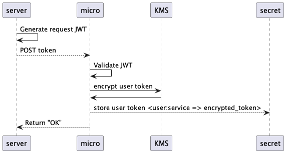
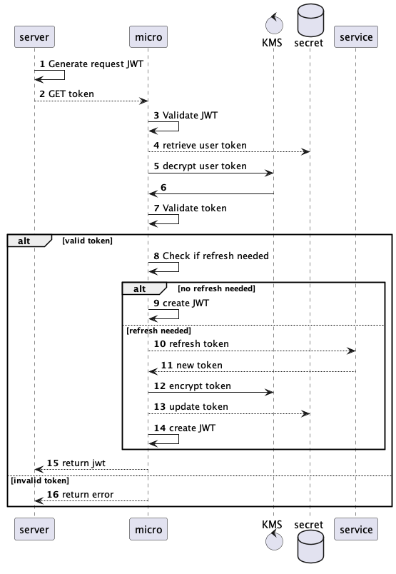

# Token Microservice (v0.0.0)

A small microservice to handle token state management.

## Work In Progress

This is currently in development and not functional yet. Will remove this section once functional version is done.

## What

This microservice implements a secure state management endpoint for managing tokens and refresh tokens so that backend system can always retrieve the latest token needed for any user and their given OAuth'd service.

Hopefully this helps myself and others that I know of that have had problems with various systems managing the custody of Oauth tokens. 

Some use cases for myself and others are:

1. Slack management tools that connects to many slack workspaces. A user can have 1 to many tokens depending on how many workspaces. Depending on what workspace is being loaded then we need different token states.
2. A remote build application that integrates with Github to see commits to branches and run deploys / view results / view history / replay logs etc. Needs management and refresh of Github tokens.
3. A discord bot that needs to connect and maintain tokens to many different servers.
4. An application that allows teams to bring their own SSO on Okta and need to manage tokens and refreshes.

## Security


1. Uses JWKS to validate requests from other backend services.
2. Returns signed JWT with latest token included
3. Tokens stored in Hashicorp Vault (For now, may do MongoDB or Postgres sometime soon)


## Features

- Store Token
- Get Token and ensure it's the latest one while also making sure the stored token is updated
- Allow for many tokens to one user.
- Allow for many applications to use single backend
- Supported Services
  - Slack
  - Github
- Future Services
  - Okta
  - Discord


> Depending on needs we may bake in the full auth flow to this microservice and make a mini auth system that handles user pass, magic link, and Oauth and maintains state while returning JWT tokens for other servies to use and verify.


## Planned endpoints

### Store Token

POST `/{service}`

**bearer token** = `JWT` => `asdf.asdf.asdf`

```json
Header:
{
  "alg": "HS256",
  "typ": "JWT"
}

PayLoad:
{
    "user":"<userID>",
    "token":"service token"
}
Signature: `Signature bytes`
```

**Response** = `ok` or `error`



### Retrieve Token

GET `/{service}`

Body = `JWT` => `asdf.asdf.asdf`

```json
Header:
{
  "alg": "HS256",
  "typ": "JWT"
}

PayLoad:
{
    "user":"<userID>",
}
Signature: `Signature bytes`
```

**Response** = `error` or `JWT` => `asdf.asdf.asdf`

```json
Header:
{
  "alg": "HS256",
  "typ": "JWT"
}

PayLoad:
{
    "user":"<userID>",
    "service": "<serviceID>",
    "token": "<serviceToken>"
}
Signature: `Signature bytes`
```


